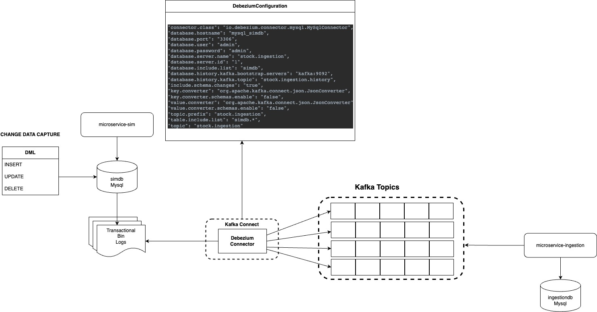

# Change Data Capture

## Pré requisitos

1. Java JDK 17+
2. Docker
3. Mysql WorkBench

## Arquitetura Proposta

1. Micro Servico SIM, terá um conector do debezium configurado para se conectar com a sua respectiva abase.
2. Micro Servico Ingestion, Terá um listener de um tópico especifico tabelas configuradas no Debezium para fazer o CDC com a baase do micro servico SIM.
3. Debezium está configurado na base de dados do micro servico SIM.
4. Com essas configuracoes feitas, o objetivo é manter as duas bases equalizadas ao que tange, lojas e stock de loja.

## Docker Compose

1. Execute o docker compose do path [clique-aqui](./docker/docker-compose.yml)
2. Verifique se todos os containers estao UP.

## Configuracoes Debezium

1. Aplique as configuracoes do debezium dentro do container.
2. Arquivo de configuracao [clique-aqui](./configuration-cdc_v2.txt)

## Configuracoes MYSQL

* SHOW VARIABLES LIKE 'server_id';
* SET GLOBAL server_id=1;
* SET GLOBAL log_bin=ON;
* show global variables like 'log_bin';
* set @@global.show_compatibility_56=ON;
* show master status;
* set GLOBAL binlog_format = 'ROW';
* set GLOBAL binlog_row_image = 'FULL';

## Teste os Eventos

1. Se tudo estiver Ok, teste os eventos fazendo insercoes diretamente no banco do SIM.

<pre>
<code>
INSERT INTO `simdb`.`lojas` (`id`, `name`,`quantity` ) VALUES ('1', 'teste',300);
INSERT INTO `simdb`.`lojas` (`id`, `name`,`quantity` ) VALUES ('2', 'teste',300);
INSERT INTO `simdb`.`lojas` (`id`, `name`,`quantity` ) VALUES ('3', 'teste',300);
INSERT INTO `simdb`.`lojas` (`id`, `name`,`quantity` ) VALUES ('4', 'teste',300);
INSERT INTO `simdb`.`lojas` (`id`, `name`,`quantity` ) VALUES ('5', 'teste',300);
INSERT INTO `simdb`.`lojas` (`id`, `name`,`quantity` ) VALUES ('6', 'teste',300);
</code>
</pre>

